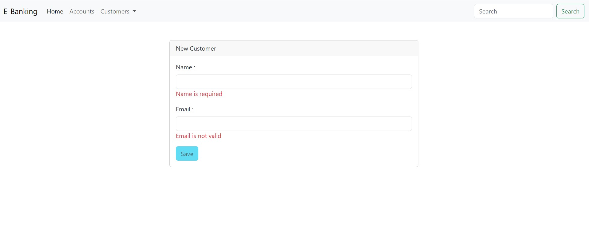

#   E-banking FRONT-END USING ANGULAR 

<h4>Taches Realisées</h4>
- Création du projet angular nommé (digital-banking-web) avec la commande : ng new digital-banking-web
- Création des differents composants dont on aura besoin : 
<h2> Customers</h2>
- pour afficher la liste des customers dans une card chercher un customer et supprimer un customer
  <h2> new-Customers</h2>
- pour ajouter un customer a partir de UI en utilisant un formulaire où on verifie les attributs entrés 
- <h2> Accounts</h2>
pour afficher les comptes qu'on a en utilsant une barre de recherche qui cherche le compte qu'on veut
puis affichage les differents operations effectuer dans ce dernier .

<h2> Chaque Composant est constitué des 4 sous fichiers :</h2>
<h5>component.css</h5>
<h5>component.html:ui structure </h5>
<h5>component.spec.ts : tests unitaires</h5>
<h5>component.ts : fichier TypeScript qui contient la logique du composant</h5>
 
<h2>Creation de la partie service : </h2>
- Cette couche communique avec la partie backend en utilisant HttpClientModule qui permet de charger et recuperer les données 
cette recuperation est permise dans la partie backend avec le @CrossOrigin(*)

<h5> UI CAPTURES </h5>
<h3>Customers</h3>

<h3>Delete Customers</h3>

<h3> Find Customers</h3>

<h3>Add Customer</h3>

<h3>Find Account </h3>

<h3>Make an opperation on Account </h3>

<h3>Customer-account</h3>

<h3>Routes utilisées</h3>

